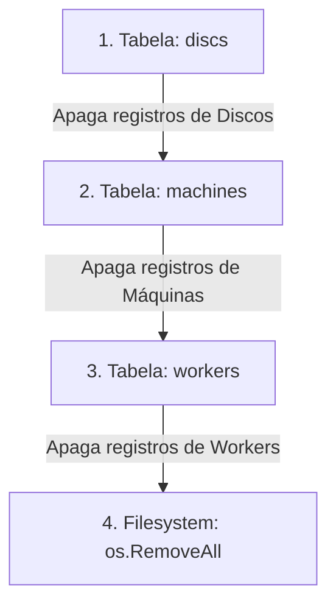

# R10 Gateway - Guia de Gerenciamento e Orquestração do Cluster (CLI Scripts)

Este guia documenta os procedimentos operacionais e a arquitetura dos scripts de linha de comando (CLI) desenvolvidos em Go para orquestrar o ciclo de vida do cluster simulado localmente. 

Esses scripts atuam no provisionamento da nossa **Topologia Multiplexada (1:N)** e constituem a base lógica operacional acionada pela nossa interface administrativa de Control Plane.

---

## 1. Topologia Multiplexada (Config Object Pattern)

Para transcender as limitações de testes rudimentares e testar concorrência pesada de I/O em um laboratório local (ou máquina de desenvolvimento), abandonamos a ideia de subir 38 processos ou containers individuais. 

Em vez disso, o script de bootstrap implementa o padrão **Config Object** (`[]WorkerConfig`), estruturando uma topologia de alta densidade computacional que instancia **4 Daemons Workers** para administrar **38 Máquinas Lógicas**:

| Worker Daemon | Tipo de Storage Engine | Qtd. de Máquinas | Capacidade/Mãq (Disc) | Padrão de Caminho Físico | Padrão do Serial do Disco |
| :--- | :--- | :--- | :--- | :--- | :--- |
| **`wkr10_1`** | **Block** | 12 máquinas | 80 MB | `/tmp/r10_cluster/machine_<hash>/` | `SN-R10-LOCAL-<hash>` |
| **`wkr10_2`** | **Block** | 12 máquinas | 80 MB | `/tmp/r10_cluster/machine_<hash>/` | `SN-R10-LOCAL-<hash>` |
| **`wkr10_3`** | **Block** | 12 máquinas | 80 MB | `/tmp/r10_cluster/machine_<hash>/` | `SN-R10-LOCAL-<hash>` |
| **`wkr10_4`** | **Inline** (*Append-Only*) | 2 máquinas | 80 MB | `/tmp/r10_cluster/machine_<hash>/` | `SN-R10-LOCAL-<hash>` |

> [!NOTE]
> **Namespaces Criptográficos**: O `<hash>` é uma string randômica de **8 caracteres alfanuméricos** (ex: `machine_aB12XyZ9`) gerada em tempo de execução no setup. Isso garante que a identificação lógica da máquina seja única e desacoplada do hardware físico em qualquer rede.

---

## 2. Provisionando o Cluster (`setup_cluster.go`)

O script de setup tem como responsabilidade materializar tanto a estrutura de pastas no sistema de arquivos do sistema operacional quanto cadastrar as entidades na base de dados relacional.

### Como Executar
No terminal de desenvolvimento, dentro do diretório do serviço Gateway:

```bash
cd apps/gateway
go run scripts/setup_cluster.go
```

### O Pipeline de Provisionamento nos Bastidores
Quando o comando é invocado, o script executa 4 fases sequenciais:
1. **Conectividade:** Conecta-se ao PostgreSQL lendo as credenciais da variável de ambiente (ou arquivo `.env`) utilizando o ORM **GORM** com TimeZone configurada em UTC.
2. **Raiz do Host:** Garante a existência do diretório raiz de montagem no sistema operacional chamando `os.MkdirAll("/tmp/r10_cluster", 0755)`.
3. **Injeção de Daemons:** Itera sobre a lista de configuração e cria os 4 Workers (`wkr10_1` a `wkr10_4`), somando e calculando em milissegundos o atributo `worker_capacity_mb` (ex: 12 máquinas $\times$ 80MB = 960MB para os workers de bloco).
4. **Alocação de Máquinas e Discos (38x):** Para cada worker, o script executa um loop de fabricação em massa onde:
   - Sorteia o namespace criptográfico de 8 caracteres (função `randomString(8)`).
   - Registra a entidade na tabela `machines` vinculando a chave estrangeira (`worker_id`) ao daemon pai.
   - Instancia e registra o dispositivo de disco na tabela `discs` atrelando-o à máquina com o número de série autogerado.
   - Cria fisicamente a pasta de armazenamento daquela máquina no disco duro via `filepath.Join(clusterRootDir, machineName)`.

---

## 3. Resetando o Cluster e Destruindo Lotes (`reset_cluster.go`)

Durante o desenvolvimento ativo de engines de storage, é comum realizarmos testes de estresse de I/O que enchem as pastas de fragmentos, blocos corrompidos ou volumes de append experimentais. O script de reset limpa completamente esse ecossistema, devolvendo o cluster ao estado zero de forma atômica e limpa.

### Como Executar
No terminal de desenvolvimento, dentro do diretório do serviço Gateway:

```bash
cd apps/gateway
go run scripts/reset_cluster.go
```

### Integridade Referencial e a "Ordem de Cascata"
O maior erro operacional ao tentar limpar clusters relacionais é executar uma deleção indiscriminada, violando amarras de chave estrangeira (Foreign Key Constraints) no PostgreSQL. 

Para impedir erros de banco, o `reset_cluster.go` atua executando uma limpeza reversa com deleção definitiva (`.Unscoped().Delete(...)`) na exata ordem hierárquica da nossa dependência de hardware:



Após limpar todos os registros sem disparar bloqueios e violações de relacionamentos no banco SQL, o script realiza a chamada destrutiva de sistema de arquivos `os.RemoveAll("/tmp/r10_cluster")`, obliterando de uma única vez as 38 pastas e todos os binários de chunks gravados nas engines de I/O no teste anterior.

---

## 4. Relação com o Control Plane (SPA Angular & Gateway Jobs)

Esses scripts representam a interface via **Linha de Comando (CLI)** para gerenciar o seu cluster R10 localmente.

Na arquitetura completa que operamos em nossa **SPA Angular (Control Plane in `/dashboard/management`)**, o Gateway disponibiliza essas mesmas rotinas diretamente através da API REST (`/api/v1/management/bootstrap` e `/api/v1/management/reset`). 

Quando acionadas pelo painel web, em vez de bloquearem o navegador aguardando as 38 alocações em disco e no PostgreSQL, o Gateway enfileira uma tarefa no modelo `Job` e dispara uma **Goroutine assíncrona** que processa exatamente a lógica destes scripts nos bastidores, permitindo o acompanhamento reativo via *polling* de HTTP 202 Accepted!
